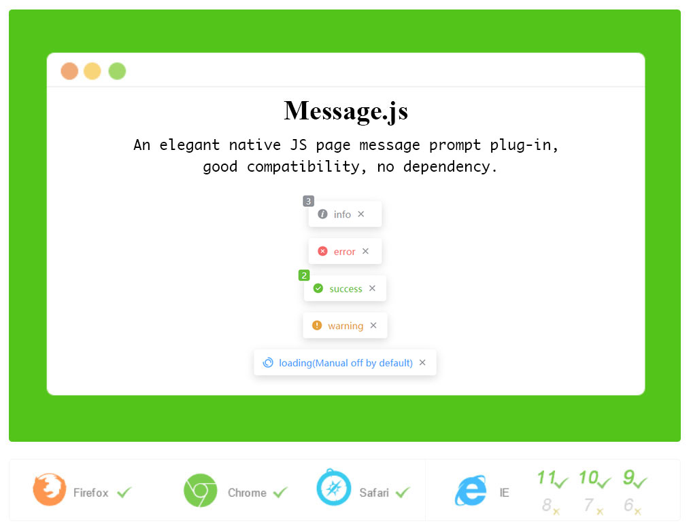

Message.js

**Plug-in Description: **An elegant native JS page message prompt plug-in, good compatibility, no dependency.


**Statement: **This plug-in is not original by the author. The author only made some modifications to meet personal needs. The following is the source information of the original plug-in:

- Original author: 或许吧（jesseqin）

- Source: https://www.jq22.com/jquery-info23550



**Usage：**

**html：**

```html
<link rel="stylesheet" href="./message.min.css">
<!-- your html -->
<script src="./message.min.js"></script>
<script>
    var configs = {};
    // Parameter configs is a configuration parameter and can be omitted
    Qmsg.info("info.", configs);
</script>
```


**Global configuration**

Before the introduction of `message. js`, it can be configured through the global variable  `QMSG_GLOBALS.DEFAULTS`

```javascript
window.QMSG_GLOBALS = {
    DEFAULTS: {
        showClose:true,
        timeout: 5000
    }
}
```

Or modify the global configuration dynamically through `Qmsg.config({})`

```javascript
Qmsg.config({
    showClose:true,
    timeout: 5000
})
```

All supported configuration information is as follows:

| **Parameter** | **JS Type** | **Description**                                              | **Default** |
| ------------- | ----------- | ------------------------------------------------------------ | ----------- |
| showClose     | Boolean     | Whether to display the close icon                            | false       |
| autoClose     | Boolean     | Whether to auto close the Qmsg                               | true        |
| timeout       | Number      | The duration of message display in MS when Qmsg is auto closing | 2000        |
| content       | String      | Message content of prompt                                    | ''          |
| onClose       | Function    | Callback function when prompt message is closed              | null        |
| html          | Boolean     | Whether to render prompt information content as HTML         | false       |
| maxNums       | Number      | The maximum number of messages displayed in the page(autoClose: true) | 5           |


**Methods supported by Qmsg**

```javascript
Qmsg.info()
Qmsg.warning()
Qmsg.error()
Qmsg.success()
Qmsg.loading()
```

All the above methods can pass 1-2 parameters, as follows:

```javascript
Qmsg.loading("loading...");
Qmsg.info("info",{
    showClose:true,
    onClose:function(){
        console.log('info prompt closed')
    }
})
Qmsg.error({
    content:"1 + 1 = 3",
    timeout:5000
})
```

**Note:** `Qmsg.loading()`is set to `autoClose = false` by default, it needs to be closed manually:

```javascript
var loadingMsg = Qmsg.loading('loading...');
// do something
loadingMsg.close();
```

If you need to close automatically, you need to call as follows:

```javascript
Qmsg.loading("loading...",{
    autoClose:true
})
// or
Qmsg.loading({
    autoClose:true,
    content:"loading..."
})
```

**Qmsg.closeAll()**

Close all messages, including it set `autoClose = false`

```javascript
var aMsg = Qmsg.info("info")
```

**close()**

Closing the current message triggers the `onClose` callback function.

```javascript
aMsg.close()
```

**destroy()**

Destroy the message without triggering the `onClose` callback function.

```javascript
aMsg.destroy()
```

